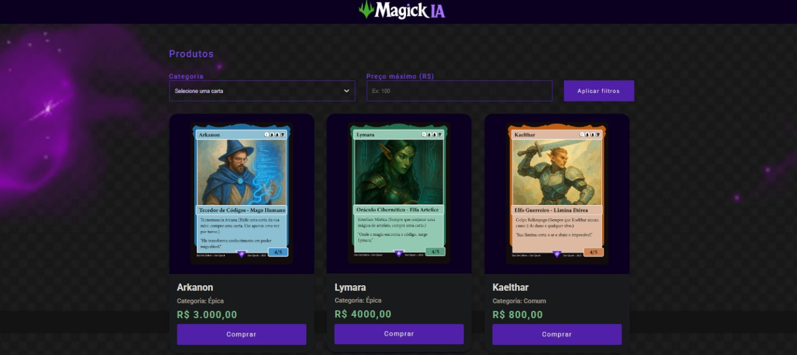

# 🔮 MagickIA - Loja de Cartas Mágicas

Projeto desenvolvido com foco em HTML, CSS e JavaScript puro, como parte do aprendizado prático. O objetivo é filtrar e exibir cartas mágicas com base na **categoria** e no **preço máximo**.

## ✨ Funcionalidades

- Filtragem dinâmica por categoria (Comum, Rara, Épica)
- Filtro de preço máximo
- Layout responsivo para dispositivos móveis
- Integração com WhatsApp para compra
- Imagens geradas por Inteligência Artificial

## 📸 Captura de Tela



## URL: http://erickao-120hzz.github.io/magickIA

## 💻 Tecnologias

- HTML5
- CSS3 (Responsivo + Reset)
- JavaScript (manipulação de DOM)
- Google Fonts (Roboto)

## 🛠️ Estrutura

projeto-magickIA/
├── index.html
├── src/
│ ├── css/
│ ├── js/
│ └── imagens/

## 🚀 Como usar

1. Clone o repositório:
   ```bash
   git clone https://github.com/erickao-120hzz/projeto-magickIA.git

Abra o index.html em seu navegador!

## 🧠 Créditos
Desenvolvido por ~Erick
Imagens geradas via Inteligência Artificial

## 📱 Contato
📸 Instagram: @erickzdv
📩 WhatsApp: 11 93228-8280
📨 E-mail: erickcarvalho661@hotmail.com

🧙‍♂️ Projeto educacional. Todos os direitos reservados - 2025.


